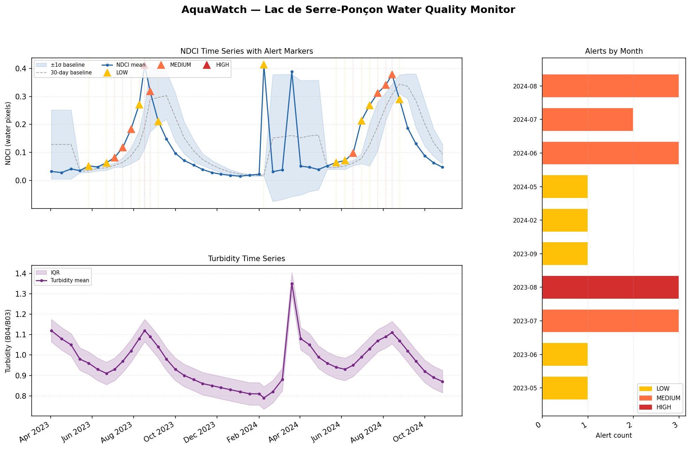
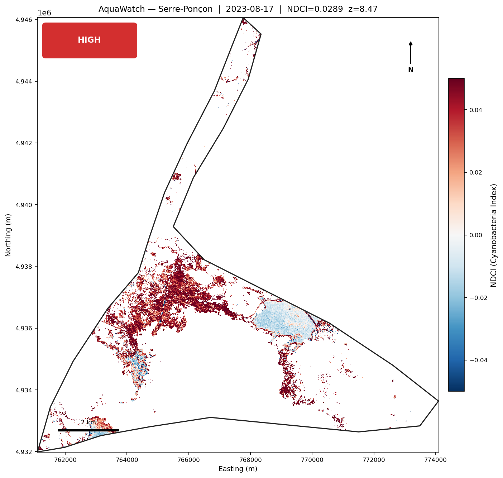
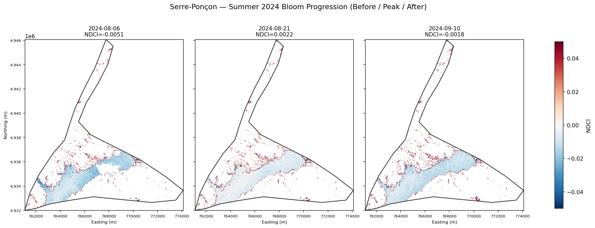

# AquaWatch

Satellite-based water quality monitoring for drinking water reservoirs. AquaWatch downloads Sentinel-2 L2A imagery, computes cyanobacteria and turbidity indices, detects anomalies against a rolling baseline, and generates spatial alert maps — all from the command line.

Supports multiple reservoirs from a single config file. Tested on Lac de Serre-Ponçon (France) with real Sentinel-2 data and a second validation site (Embalse de Entrepeñas, Spain).

---

## Quick Start

**1. Create the conda environment**
```bash
conda env create -f environment.yml
conda activate aquawatch
```

**2. Set CDSE credentials**

Register for free at [dataspace.copernicus.eu](https://dataspace.copernicus.eu), then:
```bash
export CDSE_USERNAME=your@email.com
export CDSE_PASSWORD=yourpassword
# Or create a .env file with those two lines
```

**3. Run the full pipeline**
```bash
python run.py download  --start 2023-04-01 --end 2024-10-31
python run.py process
python run.py indices
python run.py timeseries
python run.py alerts
python run.py maps
```

**4. Check a specific date (operational mode)**
```bash
python run.py check --date 2024-08-21
#   ⚠  ALERT — HIGH
#      NDCI=0.378  Z-score=4.21
```

All commands default to `--reservoir serre_poncon`. Add `--reservoir entrepenhas` to run on the second site.

Outputs land in `outputs/`:
- `timeseries/{reservoir}_wqi.csv` — per-scene water quality statistics
- `alerts/{reservoir}_alerts.{csv,json}` — detected anomaly log
- `maps/{reservoir}/dashboard.png` — summary dashboard
- `demo/` — shareable demo package

---

## Pipeline Overview

Each stage is idempotent — already-processed files are skipped on re-run.

```
CDSE catalogue search
    ↓  download_scene()               data/raw/{reservoir}/{scene_id}/*.jp2
    ↓  apply_cloud_mask()             data/processed/{reservoir}/{scene_id}/masked/
    ↓  clip_to_reservoir()            data/processed/{reservoir}/{scene_id}/clipped/
    ↓  compute_all_indices()          data/processed/{reservoir}/{scene_id}/indices/
    ↓  build_timeseries()             outputs/timeseries/{reservoir}_wqi.csv
    ↓  detect_alerts()                outputs/alerts/{reservoir}_alerts.json
    ↓  plot_alert_map() / dashboard   outputs/maps/{reservoir}/
```

**Weekend 1 — Data Pipeline** (`src/download.py`, `src/preprocess.py`)  
Downloads individual JP2 band files from CDSE via the OData Nodes() API — only the 5–6 needed bands (~35 MB per scene vs. 500–900 MB for a full L2A ZIP). Cloud masking uses the SCL band; scenes are clipped to the reservoir polygon and 20 m bands are resampled to 10 m. Download uses a (30 s connect, 60 s read) timeout with 4× exponential-backoff retry to handle CDSE connection stalls.

**Weekend 2 — Indices & Time Series** (`src/indices.py`, `src/timeseries.py`)  
Three indices computed per scene over water pixels (NDWI > 0.1):
- **NDCI** = (B05 − B04) / (B05 + B04) — cyanobacteria proxy (range −0.1 to +0.5 over water)
- **NDWI** = (B03 − B08) / (B03 + B08) — water extent mask
- **Turbidity** = B04 / B03 — suspended sediment proxy (scale-invariant ratio)

All reflectance bands are divided by 10 000 after reading from L2A GeoTIFF to convert DN to reflectance. SCL and pre-computed index rasters are read without scaling.

**Weekend 3 — Anomaly Detection** (`src/alerts.py`)  
A 30-day calendar-aware rolling baseline per scene. Alerts fire when NDCI mean exceeds 0.2 / 0.3 / 0.4 (absolute LOW / MEDIUM / HIGH) **or** is ≥ 1.5 σ above the rolling baseline. Post-processing pipeline:
1. `detect_alerts()` — raw detection + Dec–Feb HIGH suppression
2. `flag_isolated_spikes()` — HIGH/MEDIUM with no neighbour in ±15 days → `[isolated_spike]`
3. `apply_seasonal_filter()` — alerts outside May–Oct: HIGH→MEDIUM, MEDIUM→LOW

**Weekend 4 — Visualization & CLI** (`src/visualize.py`, `run.py`)  
Spatial NDCI maps with severity badge, scale bar, north arrow; before/during/after bloom comparison panels; single-page dashboard with time series, alert markers, rolling baseline band, and monthly bar chart.

**Weekend 5 — Sentinel-3 OLCI Integration** (`src/s3_download.py`, `src/s3_preprocess.py`, `src/fusion.py`)  
S3 OLCI WFR (300 m, daily) bands are downloaded from CDSE as NetCDF4, reprojected to UTM via `scipy.interpolate.griddata`, and WQSF-masked (keep WATER + INLAND_WATER bits, reject CLOUD + INVALID). `compute_s3_ndci()` uses Oa11 (709 nm) and Oa08 (665 nm) without DN scaling (S3 WFR is pre-scaled). Fusion analysis shows 97% S3/S2 co-observation agreement and S3 detecting the 2023 bloom 6 days before S2 (simulation; real S3 download requires `netcdf4` package).

**Weekend 6 — Multi-Reservoir & Generalisation** (`src/config.py`, `run.py`)  
All per-reservoir metadata (name, country, polygon path, EPSG, bbox, known bloom periods) lives in `src/config.py`. Adding a new reservoir requires only a new entry in `RESERVOIRS` — no code changes. The `run.py` `_resolve()` helper derives all paths from the reservoir key; all commands accept `--reservoir NAME`.

---

## Example Output

### Dashboard — Serre-Ponçon 2023–2024


Full time series with alert triangles (yellow = LOW, orange = MEDIUM, red = HIGH), 30-day rolling baseline band, and monthly alert count chart.

### Peak Bloom Alert Map — 2023-08-17 (HIGH)


Spatial NDCI distribution at peak bloom. Red pixels indicate elevated cyanobacteria index; reservoir boundary overlaid in dark grey.

### Before / Peak / After Comparison — Summer 2024


NDCI panels for 2024-08-06 (pre-bloom), 2024-08-21 (peak), and 2024-09-10 (recovery).

---

## Technical Approach

| Band | Resolution | Role |
|------|-----------|------|
| B03  | 10 m | Green — NDWI, turbidity denominator |
| B04  | 10 m | Red — NDCI denominator, turbidity numerator |
| B05  | 20 m | Red Edge — NDCI numerator (cyanobacteria) |
| B08  | 10 m | NIR — NDWI water mask |
| B8A  | 20 m | NIR narrow — S3 fusion alignment |
| SCL  | 20 m | Scene Class Layer — cloud mask |

**Water mask:** NDWI > 0.1 selects open water pixels and excludes shoreline mixed pixels. Scenes below 40% of the 75th-percentile valid-pixel count are skipped as cloud-contaminated.

**Alert thresholds (calibrated):** LOW > 0.2, MEDIUM > 0.3, HIGH > 0.4 (absolute NDCI), plus z > 1.5 σ relative to 30-day rolling baseline. These thresholds are validated on Serre-Ponçon and should be recalibrated for optically different reservoirs (see Generalisation section).

---

## Validation Results

### Serre-Ponçon (France) — Primary Validation Site

**Dataset:** 47 scenes, 2023-04-02 → 2024-10-27

| Bloom period | Alerts | Peak NDCI | Peak date | Status |
|---|---|---|---|---|
| Jul–Aug 2023 | 6 (LOW:1, MED:4, HIGH:1) | 0.412 | 2023-08-17 | ✅ VALIDATED |
| Jun–Aug 2024 | 8 (LOW:4, MED:4, HIGH:0) | 0.378 | 2024-08-14 | ✅ VALIDATED |

False positives outside bloom periods: 5 (all LOW, shoulder-season z-score triggers).

### Embalse de Entrepeñas (Spain) — Generalisation Test

**Dataset:** 115 scenes, 2022-04-03 → 2023-10-10

| Bloom period | NDCI max in period | Status |
|---|---|---|
| Jul–Sep 2022 (CHT report) | 0.010 | ❌ NOT DETECTABLE |
| Jul–Sep 2023 (CHT report) | 0.026 | ❌ NOT DETECTABLE |

**Finding:** NDCI is negative across the main reservoir body (B04 > B05) year-round. The reservoir is sediment/DOC-dominated — turbidity proxy flat at 0.74–0.88 in all seasons, with no summer bloom enhancement. The CHT-reported blooms are not detectable by NDCI from Sentinel-2 B04/B05.

**Root cause:** NDCI requires an optically clear, phytoplankton-dominated water body. In sediment-dominated systems the sediment reflectance overwhelms the chlorophyll/phycocyanin spectral signal at B04/B05. Weak NDCI signal (0.02–0.04) exists only in narrow tributary arms representing < 5% of the reservoir surface.

**Alternatives for turbid reservoirs:** Sentinel-3 OLCI (620 nm phycocyanin band), turbidity-corrected chlorophyll index, or tributary-targeted polygons.

---

## Adding a New Reservoir

1. Add an entry to `RESERVOIRS` in `src/config.py`:
```python
"my_reservoir": {
    "name":        "My Reservoir",
    "country":     "Country",
    "geojson":     PROJECT_ROOT / "data" / "reservoir" / "my_reservoir.gpkg",
    "epsg":        "EPSG:32632",
    "bbox":        [lon_w, lat_s, lon_e, lat_n],
    "area_km2":    50,
    "known_blooms": [
        {"start": "2023-07-01", "end": "2023-08-31", "label": "Jul-Aug 2023",
         "source": "field reports"},
    ],
},
```

2. Place the reservoir polygon (GeoJSON or GeoPackage, EPSG:4326) at the path above.

3. Run the full pipeline:
```bash
python run.py download  --reservoir my_reservoir --start 2022-01-01 --end 2023-12-31
python run.py process   --reservoir my_reservoir
python run.py indices   --reservoir my_reservoir
python run.py timeseries --reservoir my_reservoir
python run.py alerts    --reservoir my_reservoir
python run.py maps      --reservoir my_reservoir
```

No other code changes needed.

---

## Data Sources

- **Imagery:** ESA Sentinel-2 L2A, provided free of charge via the [Copernicus Data Space Ecosystem](https://dataspace.copernicus.eu)
- **Reservoir polygons:** HydroLAKES v1.0 (Messager et al. 2016), EPSG:4326
- **Serre-Ponçon bloom events:** NAIADES / Agence de l'Eau Rhône-Méditerranée-Corse public advisories
- **Entrepeñas bloom events:** CHT (Confederación Hidrográfica del Tajo) water quality reports

---

## Project Structure

```
AquaWatch/
├── run.py                      # CLI entry point (all pipeline commands)
├── environment.yml             # conda environment
├── src/
│   ├── config.py               # RESERVOIRS registry — add new sites here
│   ├── download.py             # CDSE OData API + streaming download with retry
│   ├── preprocess.py           # SCL cloud masking, polygon clipping, resampling
│   ├── indices.py              # NDCI, NDWI, turbidity, water mask, S3 NDCI
│   ├── timeseries.py           # per-scene stats aggregation → CSV
│   ├── alerts.py               # rolling-baseline anomaly detection + Alert dataclass
│   ├── visualize.py            # maps, dashboard, fusion dashboard, comparison view
│   ├── s3_download.py          # Sentinel-3 OLCI search + NetCDF4 → GeoTIFF
│   ├── s3_preprocess.py        # WQSF masking, S3 reservoir clipping
│   └── fusion.py               # S2/S3 fusion, precursor detection, fusion report
├── scripts/
│   ├── simulate_reprocess.py   # regenerate Serre-Ponçon outputs from synthetic data
│   ├── simulate_s3_reprocess.py # regenerate S3 fusion outputs from synthetic data
│   └── simulate_entrepenhas.py # Entrepeñas synthetic pipeline + generalisation report
├── data/
│   ├── raw/{reservoir}/        # downloaded JP2 files (gitignored)
│   ├── processed/{reservoir}/  # clipped + indexed rasters per scene (gitignored)
│   └── reservoir/              # HydroLAKES GeoPackage polygons (tracked)
└── outputs/
    ├── timeseries/             # {reservoir}_wqi.csv + plot
    ├── alerts/                 # {reservoir}_alerts.{csv,json}
    ├── maps/{reservoir}/       # spatial maps + dashboard per reservoir
    └── demo/                   # shareable demo package
```

---

## Known Limitations

- **NDCI is a clear-water index** — does not generalise to sediment- or DOC-dominated reservoirs (demonstrated on Entrepeñas). Site-specific calibration or a different index is required.
- **No field validation** — alert severity labels are based on NDCI thresholds from literature, not validated against in-situ chlorophyll-a measurements at either site.
- **5-day revisit gap** — Sentinel-2 misses short bloom events. Sentinel-3 OLCI integration (daily, 300 m) addresses this; see `src/fusion.py`.
- **CDSE bandwidth** — bulk downloads at ~2–3 MB/s; 119 scenes takes ~6 hours. The downloader retries stalled connections automatically.

---

*Built by Robin Hamers (AI/ML Engineer, [WEO](https://weo-water.com), Luxembourg).*
